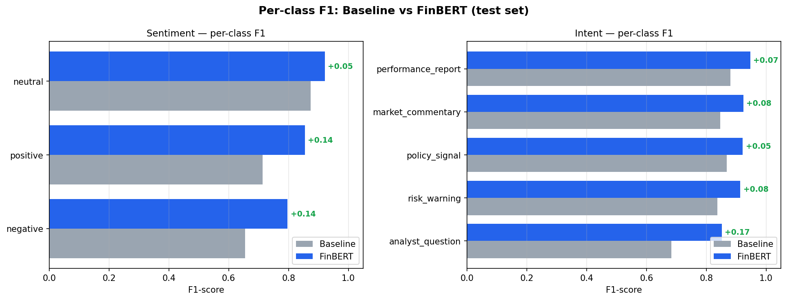
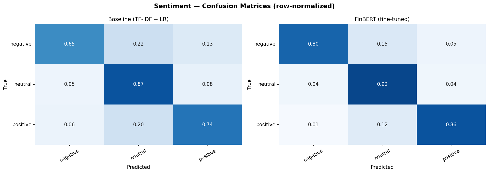
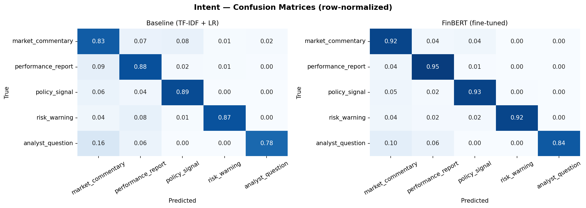
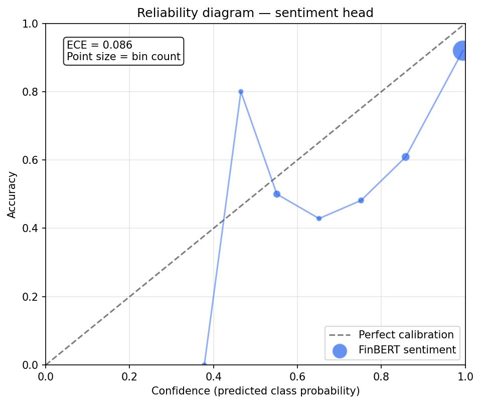

# Fine-tuned Sentiment & Intent Classifier for Canadian Finance

**Problem.** Classify Canadian financial text along two axes simultaneously: sentiment (bearish / neutral / bullish) and intent (what the text is *doing* — reporting performance, warning of risk, signaling policy, etc.). Most public finance-sentiment models cover only sentiment, and almost none target the Canadian market specifically.

**Approach.** Fine-tuned a domain-specific encoder (FinBERT) with two classification heads on a shared transformer body. Trained on ~36,000 labeled examples assembled from three tiers: expert-annotated Financial PhraseBank, crowd-curated Twitter Financial News, and rule-based weak labels over Bank of Canada releases.

## Headline results (test set, macro F1)

| Head | Baseline (TF-IDF + LR) | FinBERT (fine-tuned) | Δ |
|---|---:|---:|---:|
| Sentiment | 0.748 | **0.858** | +0.110 |
| Intent    | 0.824 | **0.912** | +0.088 |

Fine-tuning's largest per-class gains came on the rare classes where a bag-of-words baseline has no semantic knowledge to fall back on.



### Per-class breakdown

**Sentiment**

| Class | Support | Baseline F1 | FinBERT F1 | Δ |
|---|---:|---:|---:|---:|
| negative | 331 | 0.655 | 0.797 | +0.142 |
| positive | 492 | 0.714 | 0.855 | +0.141 |
| neutral | 1475 | 0.874 | 0.921 | +0.048 |

**Intent**

| Class | Support | Baseline F1 | FinBERT F1 | Δ |
|---|---:|---:|---:|---:|
| analyst_question | 51 | 0.684 | 0.851 | +0.168 |
| market_commentary | 1224 | 0.847 | 0.924 | +0.077 |
| risk_warning | 98 | 0.837 | 0.914 | +0.076 |
| performance_report | 1089 | 0.881 | 0.947 | +0.066 |
| policy_signal | 695 | 0.869 | 0.922 | +0.053 |

## Dataset & labeling strategy

Three label-quality tiers:

- **Tier 1 — Expert.** Financial PhraseBank, ~3,400 sentences labeled by humans with finance backgrounds (75% inter-annotator agreement). Sentiment only.
- **Tier 2 — Curated.** Twitter Financial News sentiment (~12,000 rows) and topic (~21,000 rows) datasets. The 20-class topic taxonomy was mapped onto a 5-class intent taxonomy I designed for this project.
- **Tier 3 — Weak.** Rule-based labeling of Bank of Canada press releases. Audited on a stratified 40-row sample:

```
WEAK-LABEL SPOT-CHECK SUMMARY
========================================
Rows audited (sentiment): 40
Sentiment rule accuracy : 85.0%
Rows audited (intent)   : 40
Intent rule accuracy    : 97.5%
========================================
Use these numbers in your case study. If accuracy is
below ~65%, tune the rules in weak_labeler.py and re-audit.
```

The 5-class intent taxonomy is itself a design choice. I originally specified six classes; one (`forward_guidance`) came out of labeling with only 20 examples, too few to evaluate. It was merged into the semantically nearest class (`market_commentary`) to preserve a defensible evaluation — a normal industry-style mid-project taxonomy revision.

## Model architecture

```
                       ┌─────────────┐
                       │  Sentiment  │ (3 classes)
                       │    head     │
                       └─────────────┘
                            ▲
  Text ──► FinBERT encoder ─┤
           (~110M params)   ▼
                       ┌─────────────┐
                       │   Intent    │ (5 classes)
                       │    head     │
                       └─────────────┘
```

Three technical choices worth calling out:

1. **Partial supervision.** Many rows have only one of the two labels (PhraseBank has no intent; Twitter intent has no sentiment). Missing labels are encoded as `-100` and `cross_entropy(..., ignore_index=-100)` skips them — so the encoder still learns from every row, but each head only trains on rows whose label exists.
2. **Class-weighted loss.** Both heads use inverse-frequency weights computed on the training set only, so rare classes (`negative` sentiment, `risk_warning` intent) aren't drowned out by majority classes.
3. **Tier-aware splitting.** Train/val/test splits stratify by label; test and val draw only from Tier-1 + Tier-2 rows, so test scores aren't an evaluation of my weak-labeling rules.

## Confusion matrices





## Performance by label tier

Does the model score equally well on different label-quality tiers? If not, the gap is a label-noise ceiling, not a model failure.

| Tier | Head | n | Macro F1 | Weighted F1 |
|---|---|---:|---:|---:|
| tier2 | intent | 3157 | 0.912 | 0.930 |
| tier1 | sentiment | 479 | 0.905 | 0.941 |
| tier2 | sentiment | 1819 | 0.845 | 0.876 |

## Error analysis

Manual categorization of a stratified random sample of FinBERT's mistakes:

```
ERROR TAXONOMY SUMMARY
==================================================

SENTIMENT  (n=50)
  genuinely_ambiguous       7  ( 14.0%)
  label_noise              12  ( 24.0%)
  missing_context          13  ( 26.0%)
  model_bias               17  ( 34.0%)
  other                     1  (  2.0%)

INTENT  (n=50)
  genuinely_ambiguous       0  (  0.0%)
  label_noise              23  ( 46.0%)
  missing_context           7  ( 14.0%)
  model_bias               20  ( 40.0%)
  other                     0  (  0.0%)

==================================================
Use these percentages in your case study. The bigger the ambiguous/noise share, the closer your model is to the ceiling imposed by the data quality itself.
```

## Calibration

Expected Calibration Error on sentiment head: **0.086** (over 1500 test predictions). A perfectly calibrated model has ECE = 0; lower is better.



## Tech stack

HuggingFace Transformers + PEFT, PyTorch, scikit-learn, BERTopic, Weights & Biases. CPU-only training — full fine-tune of FinBERT in roughly 2–4 hours on a laptop.
